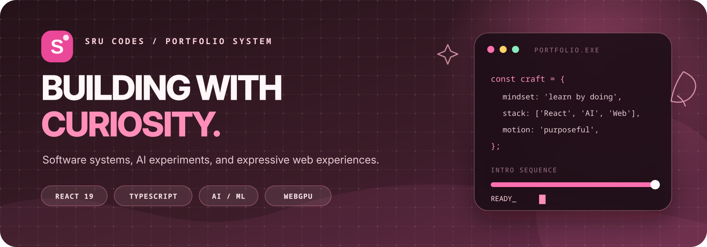
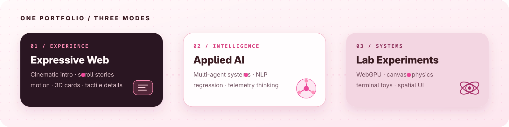
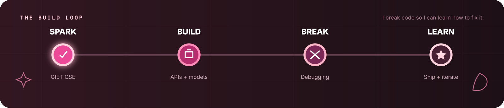

<p align="center">
  
</p>

<p align="center">
  <strong>Software systems · Applied AI · Expressive web engineering</strong><br />
  Built by <a href="https://github.com/sru-codes">Srustisri Panda</a> — B.Tech CSE student, builder, and relentless debugger.
</p>

<p align="center">
  <a href="https://sru-codes.vercel.app">Live Portfolio</a>
  ·
  <a href="https://github.com/sru-codes/myportfolio">Source</a>
  ·
  <a href="https://github.com/sru-codes">GitHub Profile</a>
  ·
  <a href="https://www.linkedin.com/in/srustisri-panda/">LinkedIn</a>
  ·
  <a href="mailto:connect@srucodes.com">Email</a>
</p>

---

## A portfolio that behaves like a small product

This is not a stack of isolated widgets. The intro, scroll system, story chapters, project explorer, technical blog, visual labs, and downloadable CV share one content model and one motion language.

<p align="center">
  
</p>

### Inside the experience

- **Cinematic onboarding** — a staged `0 → 100` introduction, narrative checkpoints, accessible progress semantics, body-scroll locking, and a reduced-motion route.
- **Scroll-driven storytelling** — horizontal and vertical narratives synchronized through Lenis, GSAP, and ScrollTrigger.
- **Applied AI content** — multi-agent marine intelligence, NLP classification, regression experiments, and telemetry-driven visual stories.
- **Interactive laboratories** — WebGPU procedural visuals, ASCII canvas flow, physics folders, terminal toys, telemetry, and a retro canvas arcade.
- **Reusable content model** — projects, skills, chapters, blog posts, profile links, and navigation live in `src/data/portfolioData.ts`.
- **Downloadable CV** — a factual, two-page PDF generated from existing portfolio content and served from `public/`.

## Learn by making the thing

The project follows a compact build loop: start with curiosity, turn the idea into code, learn from the failure, then improve the system.

<p align="center">
  
</p>

> I break code so I can learn how to fix it.

## Core stack

| Layer | Tools |
| --- | --- |
| Interface | React 19, TypeScript, Tailwind CSS 4, Motion, Lucide |
| Motion | GSAP, ScrollTrigger, Lenis |
| Experiments | WebGPU, Canvas 2D, Matter.js |
| Tooling | Vite 8, npm, TypeScript 7 |
| Delivery | Static assets, environment-free configuration, downloadable PDF |

## Project map

```text
src/
├── components/        # Portfolio sections, visual labs, and interaction systems
├── data/              # Typed projects, chapters, skills, profile, and articles
├── assets/images/     # Portfolio artwork
├── App.tsx            # Page composition and shared scroll/navigation state
├── main.tsx           # React entry point and cinematic intro gate
└── index.css          # Global visual system and motion primitives

public/
├── readme/            # Original README artwork
├── favicon.svg
└── srustisri-panda-cv.pdf
```

## Run locally

```bash
npm install
npm run dev
```

Open [http://localhost:3000](http://localhost:3000).

## Verify the project

```bash
npm run lint
npm run build
npm run preview
```

`npm run lint` runs the TypeScript compiler with `--noEmit`. The production build is written to `dist/`.

## Accessibility and performance choices

- The intro exposes progress through a named ARIA progressbar and includes a deterministic reduced-motion path.
- The main application mounts only after the intro, preventing heavy visual systems from initializing behind the loading layer.
- Scroll-linked work shares one GSAP ticker, while reduced-motion users bypass smooth-scroll hijacking.
- Offscreen visual systems pause when possible instead of rendering continuously.
- The public CV and README artwork are static files with no runtime service dependency.

## Repository notes

- Live deployment: [sru-codes.vercel.app](https://sru-codes.vercel.app).
- npm is the active package manager and `package-lock.json` is the canonical lockfile.
- Portfolio content is intentionally centralized for straightforward editing.
- The project is public, but no open-source license has been declared yet.

---

<p align="center">
  <strong>Designed and built with curiosity in Odisha, India.</strong><br />
  <a href="https://sru-codes.vercel.app">Open the live portfolio</a>
  ·
  <a href="https://github.com/sru-codes/myportfolio">Explore the source on GitHub</a>
</p>
